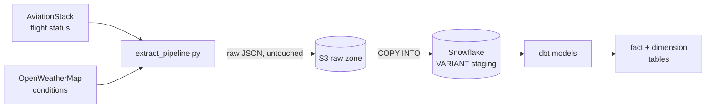

# Flight Delay Reliability Pipeline

An ELT pipeline that measures airport and airline reliability, and separates delays caused by
weather from delays caused by operational and carrier factors.

## The question

"Flights get delayed in bad weather" is not an interesting finding. The interesting question is
the inverse: **which airports and carriers show delay patterns that _don't_ track their weather?**
An airport with mild conditions and persistent delays has an operational problem. An airport that
absorbs severe weather without falling behind is running good operations. Isolating that signal
requires joining flight outcomes to the weather conditions actually present at the arrival
airport at the time of arrival — which is what this pipeline is built to produce.

## Architecture



Airflow orchestrates the sequence on two schedules — flights daily, weather hourly — running
under `systemd` on an EC2 instance, so collection does not depend on any workstation being
awake.

**Extract → Land → Load → Transform.** Raw API responses are landed in S3 exactly as received
and never modified. Snowflake holds only derived data. Everything downstream of S3 is
reproducible from it.

## Stack

| Tool | Role |
|---|---|
| Python | API extraction, error handling, S3 landing |
| AWS S3 | Immutable raw zone, partitioned by date and airport |
| Snowflake | Warehouse — `VARIANT` staging tables plus modeled fact/dimension tables |
| dbt | Transformation, testing, and documentation of the modeled layer |
| Airflow | Scheduling, retries, and task dependencies |
| AWS EC2 | Always-on host running Airflow under `systemd`, provisioned by script |

## Design decisions

These are the choices that required judgment rather than syntax.

### Codeshares are a correctness problem, not a cosmetic one

AviationStack returns one record per *marketing* flight number. A single aircraft therefore
appears many times under many airlines. In one sample, nine of ten records were codeshare
labels — Qatar Airways showed a 41-minute delay on a flight **Virgin Australia** operated, and
five separate records (China Eastern, Shenzhen, China Southern, Air China, Xiamen Air) all
described one Juneyao Air aircraft.

Attributing one aircraft's delay to five carriers would have corrupted the central analysis. The
fact table is therefore built at the **physical-flight grain**, keyed on the operating flight
plus scheduled departure, with the codeshare relationship preserved as a measure rather than as
duplicated rows. The same key resolves re-pull duplicates for free: the same aircraft pulled
twice on consecutive runs collapses to one row.

### Timestamps are local time wearing a UTC label

AviationStack returns timestamps with a `+00:00` offset that is not true — they
are local wall time at the airport, and the real zone arrives in a separate
`timezone` field. Taken at face value, trans-Pacific flights appear to land
before they take off, and every flight matches weather four to seven hours away
from its real arrival — while the freshness column still reads as healthy,
because both sides are consistently wrong.

The models therefore carry both readings under explicit names: `*_local` for the
wall time as reported, and `*_utc` converted using the zone the API supplies
separately. Delay is measured in local time, where scheduled and actual share an
airport and the difference is exact; the weather join uses UTC, where comparing
two instants is meaningful. A test asserts that no flight arrives before it
departs, which is the tripwire for this class of error returning.

### Delay is computed, not read

AviationStack's `delay` field is inconsistently populated — frequently null on flights whose
scheduled and actual times clearly differ. Delay is therefore derived directly from timestamps
(`datediff('minute', scheduled, actual)`), which is both more reliable and explicit about what
"delayed" means.

### Departure and arrival delay are tracked separately

Across a representative pull, every airport showed positive average *departure* delay but
negative average *arrival* delay — flights routinely recover 20-30 minutes in the air because
airlines pad published schedules. Measuring only arrival delay (the US DOT convention) hides
origin-side operational failures entirely, so both are retained along with a derived
`minutes_recovered`.

### The raw zone is the source of truth

When the Snowflake trial account expired and the entire warehouse was lost, recovery took
minutes and lost no data: the raw zone was untouched, so the warehouse was rebuilt from S3 by
re-running the setup and load scripts and `dbt build`. This is the practical payoff of separating Extract
and Load from Transform.

### Scope is bounded, and the two schedules are decoupled

The pipeline tracks five airports (`ATL`, `EWR`, `LAX`, `MIA`, `SFO`) rather than sampling
globally. Unbounded sampling never accumulates enough observations of any single airport to
compare reliability, and weather cannot be fetched for airports that can't be predicted in
advance.

The airports were selected to vary **independently** on weather severity and operational
reputation, so the two effects can be separated: LAX as a control (dry season, congested — its
delays are operational by construction), MIA for weather variance, ATL for severe weather with
strong operations, EWR for weak operations, SFO for fog as a mechanism distinct from convective
storms.

The two API quotas differ by orders of magnitude, so their schedules are decoupled: flights
daily (quota-bound), weather hourly. Hourly weather is what makes the eventual join meaningful —
matching every flight to a single coarse daily reading would produce a decorative column rather
than a real one.

### One source of truth for scope

`seeds/dim_airports.csv` is loaded by dbt as the `dim_airports` dimension **and** read directly
by the extract script. The pipeline and the warehouse cannot disagree about which airports are
in scope, and adding an airport is a one-line change that both sides pick up.

The same principle applies to credentials: `snowflake_setup.sql` is version-controlled and holds
`<PLACEHOLDER>` tokens substituted at runtime from `.env`, so no secret is ever written to a
tracked file.


### The host holds no cloud credentials

The EC2 instance has no AWS keys on disk and no `~/.aws` directory. It assumes an IAM role
scoped to this project's bucket alone, and boto3 resolves temporary rotating credentials through
the instance metadata service. There is nothing on the box worth stealing, and a compromise
reaches one bucket rather than an account.

Making that true required separating two things that had been conflated. The daily job
originally ran the full Snowflake setup script, which recreates external stages — and
`CREATE STAGE` embeds AWS credentials, because Snowflake reads S3 with its own keys and cannot
use an instance role. So `snowflake_setup.sql` now creates infrastructure only and is run rarely
from a trusted machine, while `snowflake_load.sql` contains just the `COPY INTO` statements,
references no credentials at all, and is what the pipeline runs daily. The runner resolves only
the placeholders a given file actually uses, so a credential-free file runs on a
credential-free host.

### Recovering the warehouse

Verified by destroying it: dropping both staging tables and running

```bash
python3 pipeline/run_snowflake_setup.py                     # recreate the objects
python3 pipeline/run_snowflake_setup.py snowflake_load.sql  # repopulate from S3
cd dbt && dbt build
```

reproduces the fact table with a byte-identical fingerprint — same row count,
same key hash, same delay total, same weather coverage.

Both commands are required. The first only creates empty objects; the
`COPY INTO` statements live in the second so that the daily pipeline can run on
a host holding no AWS credentials.

### Every layer is disposable except one

```
  EC2 instance   rebuild from infra/provision_ec2.py     ~5 minutes
  Snowflake      rebuild from S3                          done twice
  S3 raw zone    nothing upstream to rebuild from         ← the only irrecoverable layer
```

Recognising that asymmetry is what makes a teardown script safe to keep in the repository: it
destroys something designed to be destroyed. It is also why versioning is enabled on the raw
bucket — deletes there become recoverable, closing the one hole that mattered.

## Sample output

Figures below are a snapshot taken on **5 September 2026**, from an early accumulation window. They are
shown because the *shape* is what the pipeline exists to detect, not because the sample is yet
large enough to conclude from — and they will not match the warehouse once collection has moved
on. The dashboard reads live.

**Reliability by airport** — 829 physical flights:

| Airport | Flights | Avg dep delay | Avg arr delay | Recovered in air | % late arrival |
|---|---|---|---|---|---|
| SFO | 148 | 28.9 | -3.2 | 32.2 | 18.2% |
| EWR | 195 | 28.4 | -8.2 | 36.6 | 15.4% |
| MIA | 169 | 22.3 | -9.8 | 32.1 | 10.1% |
| ATL | 177 | 24.1 | -14.8 | 38.8 | 8.5% |
| LAX | 140 | 21.3 | -14.0 | 35.3 | 3.6% |

Every airport shows a positive *departure* delay and a negative *arrival* delay: flights routinely
make up half an hour in the air because airlines pad published schedules. Measuring arrivals alone,
as the industry standard does, would hide origin-side problems entirely.

**The question the project actually asks** — delays against the weather recorded at arrival
(507 of 829 flights matched to an observation within 120 minutes):

| Airport | Conditions | Flights | % late arrival |
|---|---|---|---|
| ATL | Clear | 47 | 14.9% |
| ATL | Clouds | 68 | 8.8% |
| EWR | Clear | 12 | 16.7% |
| EWR | Clouds | 109 | 17.4% |
| LAX | Clear | 85 | 5.9% |
| MIA | Clouds | 26 | 15.4% |
| MIA | Rain | 78 | 10.3% |
| SFO | Clear | 82 | 22.0% |

This is the pattern worth looking for. San Francisco under clear skies is late more often than
Miami in actual rain, and Miami's *cloudy* hours are worse than its *rainy* ones. Whatever is
delaying those flights, it is not the weather — which is the operational signal the pipeline was
built to isolate.

**Codeshare collapse is not a marginal correction.** Of 3,500 in-scope source records,
415 physical flights carried a single marketing label, 283 carried two to four, and 131
carried five or more — one aircraft appeared under 9 different airline flight numbers. Left
uncollapsed, that aircraft's delay would have counted against 9 separate carriers.

## Testing and CI

34 dbt tests run against the modelled layer, and two GitHub Actions workflows enforce them on every
push and pull request.

**The load-bearing test is `unique` on `flight_event_key`.** It is the executable proof that the
grain argument holds: if codeshare collapse or re-pull deduplication ever stopped working, it fails
immediately rather than quietly producing wrong averages.

Staging carries tests too, which is what makes `dbt build` protective — a staging model that fails
its tests never becomes the input to the fact table. Testing only the mart would let a bad source
rebuild it before anything objected.

Four singular tests guard invariants a column test cannot express: that no flight arrives before it
departs (the tripwire for timezone handling), that delay minutes stay within a plausible band, that
the weather freshness flag always agrees with the columns it governs, and that records dropped for
carrying no flight identifier stay rare — so an exclusion the model makes deliberately cannot grow
into silent data loss.

The two workflows fail for different reasons, deliberately:

| Workflow | Needs credentials | Runs |
|---|---|---|
| `ci.yml` | No | Python and DAG compilation, plus `dbt parse` against a placeholder profile — validates refs, Jinja, SQL syntax and schema files without connecting to anything |
| `dbt-build.yml` | Yes | The real `dbt build` and a headless render of the dashboard, against Snowflake |

Keeping the credential-free checks separate means they keep passing regardless of the state of the
Snowflake trial. The credentialed workflow checks whether its secrets exist and skips cleanly when
they do not, so a fork reports *skipped* rather than *failed* — a permanently red badge would be
worse than no badge.

CI builds into a throwaway schema rather than `PUBLIC`, so a test run cannot disturb the models
being analysed, and drops it afterwards in a step that always runs.

## Status

| Stage | State |
|---|---|
| Extract | Complete |
| Land (S3) | Complete |
| Load (Snowflake) | Complete |
| Transform (dbt) | Complete — staging models, airport dimension, fact table with weather join, 34 passing tests |
| Orchestrate (Airflow) | Complete — two DAGs on decoupled schedules, running under `systemd` on EC2 |
| Infrastructure | Complete — scripted provisioning, IAM role, versioned raw zone |
| Testing and CI | Complete — 34 dbt tests, two workflows on every push |
| Analysis | Pending data accumulation |

## Setup

Requires Python 3.12+, a Snowflake account, an S3 bucket, and API keys for
[AviationStack](https://aviationstack.com) and [OpenWeatherMap](https://openweathermap.org/api).

```bash
python3 -m venv ~/pipeline-venv
~/pipeline-venv/bin/pip install -r requirements.txt
cp .env.example .env        # then fill in credentials
```

Airflow is installed into a **separate** virtualenv. It and dbt pin conflicting
versions of `jinja2`, `pydantic` and `requests`, so they cannot share one
environment; Airflow invokes the pipeline as a subprocess rather than importing
it, which is why `dags/` imports a package `requirements.txt` does not install.

```bash
python3 -m venv ~/airflow-venv
~/airflow-venv/bin/pip install "apache-airflow==3.3.1" \
  --constraint "https://raw.githubusercontent.com/apache/airflow/constraints-3.3.1/constraints-3.12.txt"
```

dbt reads `~/.dbt/profiles.yml` rather than `.env`; it needs a `flight_delay_pipeline` profile
pointing at the same Snowflake account.

## Running

```bash
python3 pipeline/extract_pipeline.py flights   # daily — quota-bound
python3 pipeline/extract_pipeline.py weather   # hourly
python3 pipeline/extract_pipeline.py all

python3 pipeline/test_snowflake.py                          # connection check
python3 pipeline/run_snowflake_setup.py                     # create warehouse/database/stages
python3 pipeline/run_snowflake_setup.py snowflake_load.sql  # load new files (no AWS credentials)

cd dbt                                 # dbt must run from the project directory
dbt seed                               # load dim_airports
dbt build                              # run models and tests in dependency order
```

`run_snowflake_setup.py` is idempotent — `COPY INTO` tracks load history per table, so re-running
loads only files landed since the last run.

## Deployment

Collection runs continuously on an EC2 instance rather than a workstation, since a scheduled job
does not survive a laptop going to sleep.

```bash
python3 infra/provision_ec2.py           # IAM role, key pair, security group (all free)
python3 infra/provision_ec2.py --launch  # ...and the instance
python3 infra/terminate_ec2.py --yes     # tear it down
```

Provisioning is split so the free resources are created first and a mistake cannot leave
something billing. On the host, Airflow runs under `systemd` with `Restart=always`, so it
survives both crashes and reboots.

The host is a git checkout of this repository, so deploying a change is:

```bash
ssh -i ~/.ssh/flight-pipeline-key.pem ubuntu@<instance-ip> \
  "cd ~/Flight_Delay_Pipeline && git pull"
```

It was previously updated by `rsync`, which depended on remembering to run it. A test fix
once reached GitHub but not the host, and the scheduled run failed the next morning for a
defect that had already been corrected. Pulling from the same source the repository shows
removes that gap.

The security group permits SSH from a single address and nothing else. The Airflow UI is reached
over an SSH tunnel rather than by opening a port:

```bash
ssh -i ~/.ssh/flight-pipeline-key.pem -N -L 8080:localhost:8080 ubuntu@<instance-ip>
```

An internet-facing Airflow can trigger arbitrary DAGs, so it is never exposed directly.

## Known limitations

- **AviationStack's free tier is a live snapshot, not a historical archive.** Data accumulates
  only through repeated scheduled runs; back-filling isn't possible.
- **The free-tier quota (~100 requests/month) caps flight collection at daily.** This is the
  binding constraint on the entire pipeline's sampling frequency.
- **OpenWeatherMap's free endpoint returns current conditions only.** Weather history is built by
  the pipeline itself over time, so each flight joins to the nearest observation rather than to
  conditions measured at its exact arrival minute.
- **Carrier names arrive inconsistently cased** between the direct and codeshare fields, and are
  normalized during transformation.
- **Sampling is bounded to five airports**, so conclusions do not generalize beyond them.
- **The sample is biased by time of day.** Each request returns the most recently landed
  flights, so a daily pull captures the same slice of the clock every time. Observed arrivals
  cluster at 14:00-03:00 UTC and thin out to almost nothing between 05:00 and 13:00. Comparisons
  *between* airports remain fair, since all five are sampled in the same window, but the figures
  are not comparable to published full-day on-time statistics, and time-of-day effects cannot be
  studied from this data.
- **There is no push alerting.** A failed run is marked red in the Airflow UI and the
  dashboard's pipeline-health tab flags stale collection, but nothing sends a notification.
  Wiring failures to email or Slack would need SMTP or webhook credentials; until then,
  detection is by looking rather than by being told.
- **The host runs on a `t3.micro`**, which has less memory than Airflow comfortably wants. It is
  viable with swap and has not been OOM-killed, but there is little headroom.

## Repository structure

```
pipeline/
  extract_pipeline.py        Extraction and S3 landing (flights + weather)
  snowflake_setup.sql        Warehouse, database, stages, staging tables (needs credentials)
  snowflake_load.sql         COPY INTO only (needs none)
  run_snowflake_setup.py     Executes either, statement-by-statement, injecting only what is used
  test_snowflake.py          Connection smoke test

dbt/
  models/staging/            sources.yml, stg_flights, stg_weather
  models/marts/              fct_flight_events and its tests
  seeds/dim_airports.csv     Airport scope and coordinates — read by dbt and the extractor
  tests/                     Singular tests
  macros/                    drop_ci_schema — teardown for CI runs

dags/
  flight_pipeline_daily.py   extract -> load -> dbt build
  weather_hourly.py          weather collection on its own schedule

dashboard/app.py             Streamlit dashboard over the modelled layer

infra/
  provision_ec2.py           IAM role, key pair, security group, instance
  terminate_ec2.py           teardown

.github/workflows/
  ci.yml                     compilation and dbt parse, no credentials needed
  dbt-build.yml              full dbt build and dashboard render, against Snowflake
```
