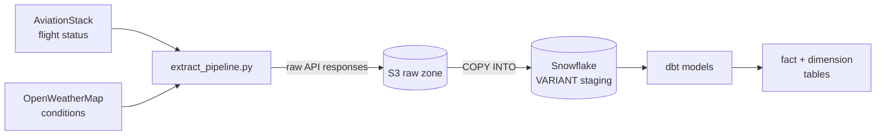

# Flight Delay Reliability Pipeline

An ELT pipeline that measures airport and airline reliability, and separates delays caused by
weather from delays caused by operational and carrier factors.

## The question

"Flights get delayed in bad weather" is not an interesting finding. The interesting question is
the inverse: **which airports and carriers show delay patterns that _don't_ track their weather?**
An airport with mild conditions and persistent delays has an operational problem. An airport that
absorbs severe weather without falling behind is running good operations. Isolating that signal
requires joining flight outcomes to the weather at the arrival airport, which is what this
pipeline is built to produce.

One refinement came out of the analysis. The fact table matches each flight to the weather just
before its *actual* landing, which is right for describing conditions on arrival but wrong for
explaining lateness: a late flight lands later, so its weather reading is partly a consequence of
the delay. Explaining delays needs the weather at the *scheduled* arrival, which is fixed before
anything goes wrong. The analysis computes that itself for now; carrying it in
`fct_flight_events` is an open pipeline task.

## Architecture


```mermaid
flowchart LR
    A[AviationStack<br/>flight status] --> C[extract_pipeline.py]
    B[OpenWeatherMap<br/>conditions] --> C
    C -->|raw API responses| D[(S3 raw zone)]
    D -->|COPY INTO| E[(Snowflake<br/>VARIANT staging)]
    E --> F[dbt models]
    F --> G[fact + dimension<br/>tables]
```

Airflow orchestrates the sequence on two schedules (flights every other day, weather hourly),
running under `systemd` on an EC2 instance, so collection does not depend on any workstation
being awake.

**Extract → Land → Load → Transform.** Raw API responses are landed in S3 and never modified
afterwards. Since 4 October 2026 they are stored byte for byte as the API sent them; earlier
files hold the same JSON re-serialised by the extractor. The bucket is versioned, so even a
delete is recoverable. Snowflake holds only derived data, and everything downstream of S3 is
reproducible from it.

## Stack

| Tool | Role |
|---|---|
| Python | API extraction, quota guard, S3 landing, Slack alerting, watchdog |
| AWS S3 | Versioned raw zone, partitioned by date, one file per airport per pull |
| Snowflake | Warehouse — `VARIANT` staging tables plus modeled fact/dimension tables |
| dbt | Transformation, testing, and documentation of the modeled layer |
| Airflow | Scheduling, retries, and task dependencies |
| AWS EC2 | Always-on host running Airflow under `systemd`, provisioned by script |
| pandas / statsmodels | Exploration and the pre-registered regression in `analysis/` (laptop only) |

## Design decisions

These are the choices that required judgment rather than syntax.

### Codeshares are a correctness problem, not a cosmetic one

AviationStack returns one record per *marketing* flight number. A single aircraft therefore
appears many times under many airlines. In one sample, nine of ten records were codeshare
labels — Qatar Airways showed a 41-minute delay on a flight **Virgin Australia** operated, and
five separate records (China Eastern, Shenzhen, China Southern, Air China, Xiamen Air) all
described one Juneyao Air aircraft.

Attributing one aircraft's delay to five carriers would have corrupted the central analysis. The
fact table is therefore built at the **physical-flight grain**, keyed on the operating flight
plus scheduled departure, with the codeshare relationship preserved as a measure rather than as
duplicated rows.

Re-pulls are a second, separate source of duplicates: the API is a live snapshot, so
consecutive runs return overlapping flights. The model removes them first, on the marketing
flight plus scheduled departure, and only then collapses codeshares onto the operating flight.
The operating key alone would still give one row per flight, but `marketing_label_count` would
count every re-pull as an extra carrier: a flight seen twice under five labels would report six.

Delay is attributed to the operating carrier's **brand**: a United Express flight operated by
SkyWest counts as United. `operating_carrier_code` keeps the operator itself, for analyses that
need to separate regional operators from the brands they fly for.

### Timestamps are local time wearing a UTC label

AviationStack returns timestamps with a `+00:00` offset that is not true — they
are local wall time at the airport, and the real zone arrives in a separate
`timezone` field. Taken at face value, trans-Pacific flights appear to land
before they take off, and every flight matches weather four to seven hours away
from its real arrival — while the freshness column still reads as healthy,
because both sides are consistently wrong.

The models therefore carry both readings under explicit names: `*_local` for the
wall time as reported, and `*_utc` converted using the zone the API supplies
separately. The weather join uses UTC, where comparing two instants is meaningful.
Delay is measured in UTC too, falling back to local wall time when a zone is
missing. On almost every row the two agree, since scheduled and actual share an
airport, but they differ on the night the clocks change. A wall time inside the
repeated or skipped daylight-saving hour does not name one instant, and the
source gives no offset to settle it, so those rows get a NULL `*_utc` and are
flagged (`has_dst_ambiguous_time`) rather than silently guessed. A test asserts
that no flight arrives before it departs, which is the tripwire for this class of
error returning.

### Delay is computed, not read

AviationStack's `delay` field is inconsistently populated — frequently null on flights whose
scheduled and actual times clearly differ. Delay is therefore derived directly from timestamps
(`datediff('minute', scheduled, actual)`), which is both more reliable and explicit about what
"delayed" means.

### "Late" is measured at the runway, not the gate

The source's "actual" times are **runway** times: departure is wheels-off and arrival is
wheels-on (`actual` equals `actual_runway` in every raw record checked, and a warn-level test
watches for that changing). The schedules are **gate** times. So:

- **Late** (`is_delayed_arrival`) means *landing* 15 or more minutes after the scheduled gate
  arrival. It is the same 15-minute threshold the US DOT uses, but not the same measurement:
  DOT counts gate arrival, which comes later by the taxi-in time, so this measure is more lenient
  (fewer flights count as late than under the gate rule). Rates here are not comparable to
  official on-time figures. A benchmark against BTS data should use `WheelsOn − CRSArrTime`,
  not `ArrDelay`.
- **Departure delay** includes the whole taxi-out, so `is_delayed_departure` is true for most
  flights and is not a lateness measure.
- This explains why every airport shows positive average departure delay and negative average
  arrival delay.

### Some schedules belong to a different flight

A record can carry times that are individually plausible and jointly impossible, because the
source occasionally pairs an actual operation with a schedule from another leg or another day.
UA7 on 2026-09-16 was scheduled thirteen hours for a flight it made in three; PXG210 on
2026-09-25 flew the night before, against the next night's slot. In both the source's own
`delay` field read 0, which is how you can tell the schedule is the broken half rather than
the arrival.

Those rows are named rather than dropped or tolerated. `has_suspect_times` marks a departure
three hours early — freight leaves an hour early routinely, so the threshold has to clear the
honest cases — or a scheduled duration more than four hours from the one actually flown,
which catches the mirror image: a flight that departs hours late and still "arrives on time"
because the source moved its scheduled arrival onto the landing. It also marks the
daylight-saving rows above. `assert_suspect_time_rate` fails if they stop being rare, since a
handful is the source having a bad day and one percent is a parsing fault.

The milder version of the re-timed schedule (left an hour or more late, "arrived" within a
minute of schedule) gets its own flag, `has_retimed_arrival_schedule`, kept separate so the
suspect flag's meaning doesn't shift. The source's delay figures are kept alongside the computed
ones, because two independent readings of the same quantity are worth comparing.

The alternative was widening the plausible-delay bounds until the bad rows fit, which would
have hidden the next real timezone fault behind an allowance made for a few bad records.

### Departure and arrival delay are tracked separately

Both are retained along with a derived `minutes_recovered` (departure delay minus arrival
delay). Because both "actual" times are runway times, `minutes_recovered` includes the taxi-out
and taxi-in as well as any padding in the schedule; taxiing is most of the typical value, so it
is an upper bound on schedule padding, not time made up in the air.

**What this does not measure.** Both figures are grouped by *arrival* airport, so the departure
number is how late those inbound flights left **their own origins** — it is not the named
airport's departure performance. Fewer than a fifth of collected flights depart from one of the
five scoped airports (488 of 2,722 as of 2 October 2026), and the per-origin samples are far too
small to stand on. Grouping the two points differently would also break the comparison: recovery
is only meaningful when both ends describe the same flights.

### The raw zone is the source of truth

When the Snowflake trial account expired and the entire warehouse was lost, recovery took
minutes and lost no data: the raw zone was intact, so the warehouse was rebuilt from S3 by
re-running the setup and load scripts and `dbt build`. This is the practical payoff of separating Extract
and Load from Transform.

### Scope is bounded, and the two schedules are decoupled

The pipeline tracks five airports (`ATL`, `EWR`, `LAX`, `MIA`, `SFO`) rather than sampling
globally. Unbounded sampling never accumulates enough observations of any single airport to
compare reliability, and weather cannot be fetched for airports that can't be predicted in
advance.

The airports were selected to vary **independently** on weather severity and operational
reputation, so the two effects can be separated: LAX as a control (dry season, congested — its
delays are operational by construction), MIA for weather variance, ATL for severe weather with
strong operations, EWR for weak operations, SFO for fog as a mechanism distinct from convective
storms.

The two API quotas differ by orders of magnitude, so their schedules are decoupled: flights
every other day (quota-bound), weather hourly. Hourly weather is what makes the eventual join
meaningful — matching every flight to a single coarse daily reading would produce a decorative
column rather than a real one. (The flights DAG keeps its historical id, `flight_pipeline_daily`,
from before the schedule changed; renaming it would orphan its run history.)

### One source of truth for scope

`seeds/dim_airports.csv` is loaded by dbt as the `dim_airports` dimension **and** read directly
by the extract script and the watchdog. The pipeline, the monitoring and the warehouse cannot
disagree about which airports are in scope, and adding an airport is a one-line change that all
of them pick up.

The same principle applies to credentials: `snowflake_setup.sql` is version-controlled and holds
`<PLACEHOLDER>` tokens substituted at runtime from `.env`, so no secret is ever written to a
tracked file.


### The host holds no AWS keys

The EC2 instance has no AWS keys on disk and no `~/.aws` directory. It assumes an IAM role, and
boto3 resolves temporary rotating credentials through the instance metadata service.
`bootstrap.sh` refuses to run if the host's `.env` still contains AWS key lines.

The role policy in `infra/provision_ec2.py` lets the host list and add files under `raw/` in
the one bucket and nothing else: no reads, no deletes. That narrower policy takes effect when
`provision_ec2.py` is next run with admin keys; until then the running host keeps the broader
bucket-scoped policy it was created with.

The host is not secret-free, though. Its `.env` (mode 600) holds the Snowflake password, both
API keys, the Slack webhook and the heartbeat URLs. Until the least-privilege `PIPELINE_ROLE`
is applied (see Deployment), that Snowflake password belongs to a user with ACCOUNTADMIN, so the
host's `.env` is the most sensitive file in the project.

Making the AWS half true required separating two things that had been conflated. The scheduled
job originally ran the full Snowflake setup script, which recreates external stages — and
`CREATE STAGE` embeds AWS credentials, because Snowflake reads S3 with its own keys and cannot
use an instance role. So `snowflake_setup.sql` now creates infrastructure only and is run rarely
from a trusted machine, while `snowflake_load.sql` contains just the `COPY INTO` statements,
references no credentials at all, and is what both DAGs run on every scheduled load. The runner
resolves only the placeholders a given file actually uses, so a credential-free file runs on a
host without AWS keys.

### Recovering the warehouse

Verified by destroying it: dropping both staging tables and running

```bash
python3 pipeline/run_snowflake_setup.py                     # recreate the objects
python3 pipeline/run_snowflake_setup.py snowflake_load.sql  # repopulate from S3
cd dbt && dbt build                                         # seed, models and tests
```

reproduces the fact table with an identical fingerprint — same row count,
same key hash, same delay total, same weather coverage. The same check is run
on every trial-account migration, against a fingerprint recorded on the old
account before it expires.

Both setup commands are required. The first only creates empty objects; the
`COPY INTO` statements live in the second so that the scheduled pipeline can run on
a host holding no AWS credentials.

### Every layer is disposable except one

```
  EC2 instance   rebuild from infra/provision_ec2.py     ~5 minutes
  Snowflake      rebuild from S3                          on every trial migration
  S3 raw zone    nothing upstream to rebuild from         ← the only irrecoverable layer
```

Recognising that asymmetry is what makes a teardown script safe to keep in the repository: it
destroys something designed to be destroyed. It is also why versioning is enabled on the raw
bucket — deletes there become recoverable, closing the one hole that mattered.

## Results

Numbers in this section are a snapshot **as of 2 October 2026** (the warehouse export the
analysis was run on: 2,722 physical flights collected 4 September – 1 October). They will not
match the warehouse once collection moves on; the dashboard reads live, and the notebooks in
`analysis/` hold the exact figures.

**Raw late-arrival rates by arrival airport**, excluding rows flagged `has_suspect_times`:

| Airport | Flights | Late arrivals |
|---|---|---|
| SFO | 437 | 19.5% |
| MIA | 638 | 13.3% |
| EWR | 649 | 12.6% |
| LAX | 509 | 10.4% |
| ATL | 481 | 10.2% |

These raw rates are not a like-for-like comparison. Each airport's sample covers a different
part of the day (see Known limitations): about a third of MIA's arrivals on the regular pulls are
scheduled between midnight and 06:00 local, against 4% of SFO's, and night arrivals are late far
less often.

**The controlled result** (`analysis/02_regression.ipynb`). On the 11 regular pulls
(7 September – 1 October, 1,726 flights after the pre-registered filters), SFO arrivals were
late 20.4% of the time against 13.4% at the other four airports, a raw gap of 7 points. A
logistic regression whose specification was committed to git before it was fitted, holding
night vs evening, airline, cargo and wind constant, with batch-clustered errors and a cluster
bootstrap, gave SFO an odds ratio of 2.05 against the rest.

That result is not robust, and the reason is a measurement flaw: its wind control was taken at
the actual landing, after the delay had happened. Late flights land later in the evening, when
the wind has dropped, so "calm" became partly a consequence of lateness, and SFO is the windiest
airport. With wind re-timed to the scheduled arrival (a correction made after seeing the result,
and before any October data existed), SFO's odds ratio is about **1.6** (1.58, 95% CI
0.86–2.90), roughly **6 points** later, with an interval that includes no difference. Every
version of the model points the same way; none of the correctly timed ones rules out chance.

Three further findings narrow it:

- **MIA's punctuality is partly an artifact.** For about 11 operators, mostly cargo and mostly
  at MIA, the source's "scheduled" arrival is really the landing time, so those flights almost
  never look late. Among scheduled passenger airlines only, MIA is late about 21% of the time,
  roughly level with SFO. SFO's estimate barely moves without those operators.
- **Same-airline comparisons don't independently confirm it.** United, Alaska and Delta are
  later into SFO than elsewhere, but carrier names are brand groups that include regional
  operators flying different routes, and they share the runway-time exposure below.
- **The runway threshold matters.** Taxi-in time isn't in the data. Shifting SFO's threshold by
  4 minutes either way moves the corrected effect between about 3.5 and 9 points.

**The confirmation test is pre-registered.** The same model runs once on the pulls from
3 to 21 October, after the 21 October load is confirmed, and only if at least 8 of those 10
pulls loaded. If SFO's true odds ratio is about 1.58, that test has only about a 29% chance of
an interval that clears 1, so an inconclusive result is the likely outcome even if the effect is
real. The outcomes were fixed in advance: clearly later is a confirmation; the same direction
with an interval including 1 is *not confirmed at this sample size*, which is not a refutation;
an odds ratio at or below 1 is evidence against.

**Weather can't yet separate the two explanations.** Only Clear, Clouds and Rain were observed
in September (no fog, storms or snow), and the condition label is unreliable: SFO hours with low
visibility are often labeled "clear sky" (`analysis/01_explore.ipynb`). An earlier version of
this README drew a weather conclusion from that label; it has been withdrawn.

**Codeshare collapse is not a marginal correction.** About two-thirds of physical flights are
sold under more than one flight number: 977 carried a single marketing label, 1,208 carried two
to four, and 537 carried five or more. One aircraft (AA2690 on 4 September) appeared under ten
different flight numbers. Left uncollapsed, that one flight would have counted ten times.

## Testing and CI

dbt runs 48 data tests against the modelled layer (as of 4 October 2026: 31 generic and 17
singular), and two GitHub Actions workflows enforce them on every push and pull request.

**The load-bearing test is `unique` on `flight_event_key`.** It is the executable proof that the
grain argument holds: if codeshare collapse or re-pull deduplication ever stopped working, it fails
immediately rather than quietly producing wrong averages.

Staging carries tests too, which is what makes `dbt build` protective — a staging model that fails
its tests never becomes the input to the fact table. Testing only the mart would let a bad source
rebuild it before anything objected.

The singular tests guard invariants a column test cannot express. Some examples:

- no flight arrives before it departs (the tripwire for timezone handling);
- delay minutes stay within a plausible band, and every landed flight has one;
- suspect schedules, rows with no timezone and records dropped for carrying no flight identifier
  all stay rare, so an exclusion the model makes deliberately cannot grow into silent data loss;
- one grain key never covers two routes (a merge the `unique` test cannot see);
- every airport has weather matched over the last 7 days, and no one airport's weather falls
  more than 6 hours behind the newest observation (a warning, not a failure: failing it would stop
  the fact table rebuilding for all five airports over a one-airport outage, which the watchdog
  already alerts on);
- temperatures are still Fahrenheit (a switch to metric would pass a simple range check).

Three singular tests warn rather than fail: the per-airport weather freshness check above, and
two tripwires on facts about the source that every delay rests on: that "actual" still means
runway time, and that no arrival is more than about an hour late (the 56-minute ceiling under
Known limitations). Either of those changing would alter what the numbers mean without breaking
anything.

The two workflows fail for different reasons, deliberately:

| Workflow | Needs credentials | Runs |
|---|---|---|
| `ci.yml` | No | Python syntax across `pipeline/`, `infra/`, `dags/`, `dashboard/` and `analysis/`; both DAGs imported under Airflow 3.3.1 in a separate job; and `dbt parse` against a placeholder profile, which validates refs, Jinja and schema files without connecting to anything. It never sends SQL to a warehouse, so malformed SQL inside a model is caught by `dbt-build.yml`, not here |
| `dbt-build.yml` | Yes | The real `dbt build`, then a headless render of the dashboard against the schema that build just created |

Keeping the credential-free checks separate means they keep passing regardless of the state of the
Snowflake trial. The credentialed workflow checks whether its secrets exist and skips cleanly when
they do not, so a fork reports *skipped* rather than *failed* — a permanently red badge would be
worse than no badge. Both workflows run with read-only repository permissions, and every
credentialed run joins one concurrency group, queued rather than cancelled, so one run's teardown
can never drop the CI schema under another.

CI builds into a throwaway schema rather than `PUBLIC`, so a test run cannot disturb the models
being analysed, and drops it afterwards in a step that always runs.

## Status

| Stage | State |
|---|---|
| Extract | Complete |
| Land (S3) | Complete |
| Load (Snowflake) | Complete |
| Transform (dbt) | Complete — staging models, airport dimension, fact table with weather join, 48 data tests |
| Orchestrate (Airflow) | Complete — two DAGs on decoupled schedules, running under `systemd` on EC2 |
| Infrastructure | Complete — scripted provisioning, IAM role, versioned raw zone. Least-privilege Snowflake role written but not yet applied |
| Testing and CI | Complete — two workflows on every push |
| Analysis | First pass done on September data (exploration and a pre-registered regression): suggestive, not confirmed. Confirmation test on 3–21 October pulls pending |

## Setup

Requires Python 3.12 (CI, the EC2 host and the Airflow constraints file all use 3.12; the
pinned pandas and matplotlib have no wheels for newer versions), a Snowflake account, an S3
bucket, and API keys for [AviationStack](https://aviationstack.com) and
[OpenWeatherMap](https://openweathermap.org/api).

```bash
python3.12 -m venv ~/pipeline-venv
~/pipeline-venv/bin/pip install -r requirements.txt
cp .env.example .env        # then fill in credentials
```

Airflow is installed into a **separate** virtualenv. It and dbt pin conflicting
versions of `jinja2`, `pydantic` and `requests`, so they cannot share one
environment; Airflow invokes the pipeline as a subprocess rather than importing
it, which is why `dags/` imports a package `requirements.txt` does not install.

```bash
python3.12 -m venv ~/airflow-venv
~/airflow-venv/bin/pip install "apache-airflow==3.3.1" \
  --constraint "https://raw.githubusercontent.com/apache/airflow/constraints-3.3.1/constraints-3.12.txt"
```

dbt reads `~/.dbt/profiles.yml` rather than `.env`; it needs a `flight_delay_pipeline` profile
pointing at the same Snowflake account.

The notebooks need extra packages, installed on the laptop only and never on the EC2 host:

```bash
~/pipeline-venv/bin/pip install -r requirements.txt -r analysis/requirements.txt
```

They read Snowflake with the `.env` credentials (so start Jupyter from the repository) and fall
back to a local CSV export of the warehouse when Snowflake is unavailable.

## Running

```bash
python3 pipeline/extract_pipeline.py flights   # every other day — quota-bound, 5 requests
python3 pipeline/extract_pipeline.py weather   # hourly
python3 pipeline/extract_pipeline.py all       # both; stops before weather if the flights budget refuses

python3 pipeline/test_snowflake.py                          # connection check
python3 pipeline/run_snowflake_setup.py                     # create warehouse/database/stages/role
python3 pipeline/run_snowflake_setup.py snowflake_load.sql  # load new files (no AWS credentials)

cd dbt                                 # dbt must run from the project directory
dbt seed                               # load dim_airports
dbt build                              # run models and tests in dependency order

streamlit run dashboard/app.py         # from the repository root
```

Both Snowflake commands are safe to re-run. The setup file uses `CREATE ... IF NOT EXISTS` for
anything holding data and only replaces the stages and file format; `snowflake_load.sql`'s
`COPY INTO` tracks load history per table, so re-running loads only files landed since the last
run.

The flights extract exits with distinct codes so a failure says what happened: 3 when the
monthly budget guard refused the run (expected late in a month), 4 when the guard could not list
S3 and so refused rather than guess, and 5 when a whole source collected nothing. (Not 1, because
Python exits 1 on any crash, and a crash should not read as an empty API response.) The guard
counts the flight files landed this calendar month (UTC), which assumes AviationStack's quota
resets on the 1st; check the reset date on the AviationStack dashboard.

## Deployment

Collection runs continuously on an EC2 instance rather than a workstation, since a scheduled job
does not survive a laptop going to sleep.

```bash
python3 infra/provision_ec2.py           # IAM role, key pair, security group (all free)
python3 infra/provision_ec2.py --launch  # ...and the instance

# then, on the host, from a clone of this repository:
#   copy .env across, then DELETE its AWS_ACCESS_KEY_ID and AWS_SECRET_ACCESS_KEY lines
bash infra/bootstrap.sh                  # venvs, dbt profile, airflow.cfg, systemd units, start

python3 infra/terminate_ec2.py --yes     # tear it down
```

Provisioning is split so the free resources are created first and a mistake cannot leave
something billing. On the host, Airflow runs under `systemd` with `Restart=always`, so it
survives a crash of the service and reboots. A scheduler that dies *inside* a running service
is invisible to systemd; the watchdog catches that one (see Monitoring).

`bootstrap.sh` exists because provisioning only ever produced a bare Ubuntu box. Everything
that made it a *pipeline* host — two virtualenvs, the dbt profile, the Airflow config, three
`systemd` units — was configured by hand and lived only on the running machine. The data was
recoverable from S3 and the warehouse rebuildable with dbt, but the host was not reproducible
from this repository, so the recovery story covered only half of what recovery actually needs.

It is idempotent, so it doubles as a repair tool when one piece of a host has drifted, and it
rewrites the unit files for whichever user and path it finds rather than assuming
`/home/ubuntu`. In particular it:

- **generates `~/.dbt/profiles.yml` from `.env`**, including the role (`SNOWFLAKE_ROLE`,
  defaulting to ACCOUNTADMIN). dbt cannot read `.env`, so those credentials otherwise exist in
  two places that drift apart silently — the symptom is `test_snowflake.py` passing while
  `dbt debug` fails, which reads like a Snowflake problem rather than an editing mistake;
- points Airflow's `dags_folder` at the repository, turns off the example DAGs, and makes new
  DAGs start unpaused;
- restarts Airflow only when its unit file or config actually changed, and never between 08:50
  and 09:30 UTC, where a restart could kill the flights run. A restart postponed for that reason
  is remembered (a `~/.airflow_restart_pending` marker) and done on the next run;
- tightens `.env` and the Airflow UI password file to mode 600;
- exits non-zero, without saying the host is ready, unless both DAGs are registered.

The host is a git checkout of this repository, so deploying a change is:

```bash
ssh -i ~/.ssh/flight-pipeline-key.pem ubuntu@<instance-ip> \
  "cd ~/Flight_Delay_Pipeline && git pull"
```

It was previously updated by `rsync`, which depended on remembering to run it. A test fix
once reached GitHub but not the host, and the scheduled run failed the next morning for a
defect that had already been corrected. Pulling from the same source the repository shows
removes that gap.

The security group permits SSH from a single address and nothing else. The Airflow UI binds to
`127.0.0.1` and is reached over an SSH tunnel rather than by opening a port:

```bash
ssh -i ~/.ssh/flight-pipeline-key.pem -N -L 8080:localhost:8080 ubuntu@<instance-ip>
```

An internet-facing Airflow can trigger arbitrary DAGs, so it is never exposed directly. Airflow's
worker log ports (8793/8794) do listen on all interfaces, so they must stay closed in the security
group.

### Switching to the least-privilege Snowflake role — not yet applied

Section 6 of `snowflake_setup.sql` defines `PIPELINE_ROLE`: it can use the warehouse, read the
two stages, and own the tables and views in the pipeline's schema, which is everything the load,
dbt and the watchdog need. Today they still run as the trial user's default role, ACCOUNTADMIN.
To switch:

1. **On the laptop**, run `python3 pipeline/run_snowflake_setup.py`. It needs the AWS keys,
   and it recreates the stages and then re-applies the role's grants on them.
2. **As ACCOUNTADMIN in a Snowflake worksheet**, run the commented `CREATE USER PIPELINE_SVC ...
   TYPE = LEGACY_SERVICE` and `GRANT ROLE PIPELINE_ROLE TO USER PIPELINE_SVC` statements at the
   end of `snowflake_setup.sql`, with a new long random password. They are not run by the script
   because a password never goes in a tracked file. Without this separate user, the host's
   password still belongs to someone who can switch to ACCOUNTADMIN.
3. **Test from the laptop** with `SNOWFLAKE_ROLE=PIPELINE_ROLE` in `.env` and
   `role: PIPELINE_ROLE` in `~/.dbt/profiles.yml`: run
   `python3 pipeline/run_snowflake_setup.py snowflake_load.sql` and `dbt build`.
   (`test_snowflake.py` ignores `SNOWFLAKE_ROLE`, so it does not test the role.)
4. **On the host**, put `PIPELINE_SVC`'s user and password and `SNOWFLAKE_ROLE=PIPELINE_ROLE`
   in `.env`, then re-run `bash infra/bootstrap.sh`, which writes the role into the dbt profile.
5. **Optionally, CI.** Moving the GitHub secrets to `PIPELINE_SVC` also needs a workflow change:
   `dbt-build.yml` currently hard-codes `role: ACCOUNTADMIN` and creates and drops its own `CI`
   schema, which `PIPELINE_ROLE` has no grant for.

## Monitoring

Two mechanisms, because they catch different failures.

**Task failures** — both DAGs attach an `on_failure_callback` to `default_args`, so
every task alerts to Slack when it fails, with a hint for the extract's known exit codes. The
callback runs at the moment something is already broken, which dictates its design: it never
raises (an exception inside a callback would bury the original failure under an unrelated
traceback), never blocks (a 10-second timeout: in Airflow 3 the callback runs in the failing
task's own process, so a hung Slack would hold that task, and with `max_active_runs=1` the DAG's
only run slot, open), and never logs the webhook URL, which is a credential. Repeat failures of
the same task alert at most once every 6 hours, with a count of the ones in between, so one
Snowflake outage doesn't become 24 hourly alerts; an `on_success_callback` posts one line when a
task that had alerted succeeds again. It is inert when `SLACK_WEBHOOK_URL` is unset, so a fresh
clone still runs.

**Everything else** — `pipeline/watchdog.py` runs on a systemd timer independent of
Airflow, because the callback is structurally unable to report failures where nothing
runs at all:

| Failure | Caught by |
|---|---|
| A task runs and fails | `on_failure_callback` |
| Airflow service stopped | watchdog (service state) |
| Scheduler dead or hung inside a running service | watchdog (scheduler heartbeat), with one automatic restart |
| DAG dropped by an import error | watchdog (dagbag check) |
| Data going stale while every task passes, overall or at one airport | watchdog (freshness, per airport) |
| Flights landing in S3 but the fact table no longer advancing | watchdog (newest arrival in `fct_flight_events`) |
| A bad edit to a module the watchdog shares with the DAGs | watchdog (a self-contained fallback alert) |
| Instance stopped outright | external heartbeat (dead-man's switch) |

That last row is why the watchdog also pings an external service. Nothing running on the
box can report the box being gone — the alert would have to come from the machine that
is absent, so the symptom is silence, which reads exactly like health. A dead-man's
switch inverts it: the external service expects a ping on a schedule and alerts when one
stops arriving. Set `HEARTBEAT_URL` in `.env` to any ping-URL service (healthchecks.io,
Cronitor, Better Stack); the watchdog appends `/fail` when a check fails so the service
alerts immediately instead of waiting out the grace period. Unset, it is a no-op.

One URL has a blind spot: a long, expected problem (flights stale for days after the monthly
budget runs out) holds the check in its failing state, so a host that then stopped would change
nothing the service could see. Setting a second URL, `HEARTBEAT_CHECKS_URL`, splits the two:
`HEARTBEAT_URL` becomes pure liveness and is always pinged plain, and the checks' pass-or-fail
goes to the second one.

The scheduler row comes from a real outage. `airflow standalone` runs the scheduler as a
child process and does not restart it. On 4 October 2026 the scheduler crashed on a SQLite
"database is locked" error while its parent kept running, so systemd reported the service as
active and nothing was scheduled for about five and a half hours. The only alert came from
the freshness check, four hours in. The watchdog now asks Airflow directly whether a
scheduler has heartbeated recently (`airflow jobs check`). If none has, it restarts Airflow
and says so in the alert, within these limits:

- **One restart per outage**, and none within three hours of the last. A scheduler that dies
  again soon after a restart has a problem a restart won't fix, so it is left for a human.
- **Only for a definitely dead scheduler.** If the check itself can't run (a timeout, a locked
  database), that is reported, never acted on.
- **Not around the 09:00 UTC flights run** (08:50 to 09:30), where a restart could kill the
  run mid-way and lose that day's flights. A dead scheduler there gets restarted on the next tick.
- **Not in the first 10 minutes after Airflow starts**, before its scheduler has heartbeated.

A problem whose wording changes, such as "restarted automatically" turning into "needs a
human", always posts, whatever the six-hour re-alert throttle says.

Liveness checks (service state, scheduler heartbeat, dagbag) are local and run every 30
minutes, so a dead scheduler is caught and restarted within about half an hour. The freshness check queries
Snowflake, which wakes the warehouse for its 60-second minimum billing period, so it is
gated to once every 2 hours — at the liveness cadence it would cost roughly 24 credits a
month against a pipeline that consumes about 13. A weather gap is therefore reported about
3 to 5 hours after the last good pull; a failed run still alerts at once through the callback.
Between freshness runs the last result carries forward, so the heartbeat keeps failing while a
problem is outstanding. Watchdog alerts are throttled through a state file: an ongoing problem
re-alerts at most every 6 hours, and recovery is announced once, retried for up to a day if
Slack doesn't accept it.

```bash
python3 pipeline/watchdog.py                      # run the checks once
systemctl list-timers pipeline-watchdog.timer     # when it next fires
journalctl -u pipeline-watchdog.service -n 20     # what it last found
```

## Known limitations

- **AviationStack's free tier is a live snapshot, not a historical archive.** Data accumulates
  only through repeated scheduled runs; back-filling isn't possible.
- **The free-tier quota (100 requests/month) caps flight collection at every other day.**
  One run spends five requests, one per airport, so daily collection would need 150 a month
  and exhaust the quota two-thirds of the way through. This is the binding constraint on the
  entire pipeline's sampling frequency, and the extract refuses to start a run that would
  overrun a 90-request monthly budget rather than discovering the ceiling by being refused
  mid-run. The schedule uses 75–80 of those, so only two or three manual runs a month are free.
  In September, manual runs during the build used enough of the budget that the guard refused
  the 27 and 29 September runs; those flights are lost for good.
- **No arrival in the data is more than 56 minutes late**, even though hundreds of flights left
  an hour or more late. The limit is in the raw payloads, not in dbt, and the values are not
  clipped (there is no pile-up at 56): flights much more than about 50 minutes late are simply
  missing. The cause is unconfirmed; the likeliest is the API not listing very late flights as
  landed. Every late rate is therefore a lower bound, and severity (how late, not how often)
  can't be compared. A warn-level test fires if the ceiling ever moves.
- **"Late" is runway-based** (see Design decisions), so rates are not comparable to official
  DOT/BTS on-time figures, and taxi-in time, which differs by airport, is invisible.
- **OpenWeatherMap's free endpoint returns current conditions only.** Weather history is built by
  the pipeline itself over time, so each flight joins to the nearest observation rather than to
  conditions measured at its exact arrival minute. In September only clear, cloudy and rainy
  conditions were observed, so the weather side of the question has little to work with yet.
- **Carrier names arrive inconsistently cased and split across liveries**, and are normalized
  during transformation.
- **Sampling is bounded to five airports**, so conclusions do not generalize beyond them.
- **The sample is biased by time of day, differently at each airport.** All five airports are
  pulled at the same moment (09:00 UTC), and each request returns the 100 most recent landed
  records, with codeshare labels counting toward the 100, so a pull holds only about 25–55
  physical flights. On the regular pulls, observed arrivals fall between roughly 20:00 and
  09:00 UTC (late afternoon to the early hours, US time); the only daytime flights come from the
  manual pulls on 4–5 September. Because traffic and codesharing differ, each airport's pull
  reaches back a different distance: EWR's to about 16:00 local, LAX's and ATL's only to about
  18:00–19:00 (typical regular pulls, measured on the raw responses). And the time zones differ, so the local-hour mix differs too: about a
  third of MIA's arrivals are scheduled between midnight and 06:00 local, against 4% of SFO's.
  Raw late rates (including the dashboard's airport ranking) are therefore not a like-for-like
  comparison between airports. The regression holds night vs evening constant for this reason,
  which only partly adjusts for afternoon vs evening. None of the figures are comparable to
  published full-day on-time statistics, and time-of-day effects themselves can't be studied
  from this data.
- **The host runs on a `t3.micro`**, which has less memory than Airflow comfortably wants. It is
  viable with swap and has not been OOM-killed, but there is little headroom.
- **A stopped instance is only caught from outside.** Failure alerting and the watchdog both
  run on the host they monitor, so on their own a stopped or unreachable instance produces
  silence. The external heartbeat (`HEARTBEAT_URL`) closes this, but only if it's configured.
- **Airflow runs as `airflow standalone` on SQLite.** SQLite lets only one process write at
  a time, so the scheduler regularly hits "database is locked" errors. It usually survives
  them, but on 4 October 2026 one killed it (see Monitoring). The watchdog now catches and
  restarts a dead scheduler. The cause would go away with Postgres as Airflow's database
  and the scheduler run as its own service, which hasn't been done, given the `t3.micro`'s memory.
- **The pipeline still connects to Snowflake as ACCOUNTADMIN.** The least-privilege role is
  written but not yet applied (see Deployment).

## Repository structure

```
pipeline/
  extract_pipeline.py        Extraction, monthly quota guard, S3 landing (flights + weather)
  snowflake_setup.sql        Warehouse, database, stages, staging tables, PIPELINE_ROLE (needs credentials)
  snowflake_load.sql         COPY INTO only (needs none)
  run_snowflake_setup.py     Executes either, statement-by-statement, injecting only what is used
  test_snowflake.py          Connection smoke test
  notify.py                  Slack failure and recovery callbacks for both DAGs
  watchdog.py                Liveness, freshness and heartbeat checks, outside Airflow
  thresholds.py              Freshness thresholds, coupled to the DAG schedules

dbt/
  models/staging/            sources.yml, schema.yml, stg_flights, stg_weather
  models/marts/              fct_flight_events and its tests
  seeds/dim_airports.csv     Airport scope and coordinates — read by dbt, the extractor and the watchdog
  tests/                     Singular tests
  macros/                    drop_ci_schema (CI teardown), local_time (DST-safe UTC conversion)

dags/
  flight_pipeline_daily.py   extract -> load -> dbt build, every other day (historical name)
  weather_hourly.py          weather collection on its own schedule

analysis/                    Laptop only
  flights_data.py            Shared loading and preparation (Snowflake, or the CSV export)
  01_explore.ipynb           Exploration
  02_regression.ipynb        Pre-registered regression, results and the October test's rules
  requirements.txt           Analysis-only dependencies

dashboard/
  app.py                     Streamlit dashboard over the modelled layer
  smoke_test.py              Headless render, run by CI
.streamlit/config.toml       Dashboard theme

infra/
  provision_ec2.py           IAM role, key pair, security group, instance
  bootstrap.sh               Turns a bare Ubuntu host into a pipeline host
  systemd/                   airflow.service, pipeline-watchdog.service and .timer
  allow_my_ip.py             Re-points the SSH rule at your current address
  backup_raw.py              Mirrors the S3 raw zone to a local folder
  terminate_ec2.py           teardown

.github/workflows/
  ci.yml                     syntax, DAG import and dbt parse, no credentials needed
  dbt-build.yml              full dbt build and dashboard render, against Snowflake
```
